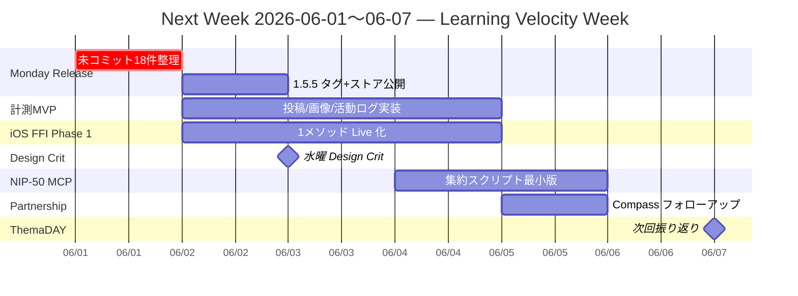

# ThemaDAY 2026-05-31 — Week Review (2026-05-25〜31) and Next-Week Strategy

## Summary

2026-05-31 (日) 未明の ThemaDAY 内省回。今週は **「定着の週」(themaday-2026-05-25)** として始まり、リリース列車 (1.5.0→1.5.4)・パートナーシップ初動 (Nostr Compass #24)・IP ドクトリン (ADR-0011)・Monday Release System (ADR-0012) の制度化が連続して走った。コードと文化、両方が前進した週。

一方で、(a) コミットの曜日偏在 (月火集中 / 水土ゼロ)、(b) 計測ループの未着手、(c) 未コミット変更 7 ファイル + 11 untracked の放置、(d) iOS Rust FFI Phase 1 と NIP-50 MCP feedback-loop の宣言だけで実装未着手、という 4 つの「学習速度を阻害する負債」が見える。

次週 (2026-06-01〜07) は **新機能の量を増やすのではなく、学習速度を上げる週** とし、Monday Release 列車に乗せる 1.5.5 を起点に、計測 MVP・iOS Phase 1 実装・水曜 Design Crit・NIP-50 MCP の第一歩を順番に置く。

## Current behavior

ThemaDAY は週次の経営/内省アラインメント儀式として運用されている (前掲 themaday-2026-05-25)。本ページはその週次振り返り版で、KPT 形式の内省 + 次週ガントを wiki に蓄積する。

## Inputs reviewed

- 今週の git 履歴 (2026-05-25 00:00〜2026-06-01 00:00): 16 commits, 4,597 insertions, 614 deletions
- `docs/wiki/log.md` 末尾 (5/24, 5/25 のラッシュ + 5/29 iOS version bump)
- 今週新規作成された戦略/ADR:
  - `docs/wiki/strategy/themaday-2026-05-25.md` (Learning Organization alignment)
  - `docs/wiki/strategy/themaday-2026-05-28-partnerships.md` (Nostr Compass)
  - `docs/wiki/strategy/nuruh-ip-2026-05-28.md` (Nuruh IP v1.0)
  - `docs/wiki/decisions/adr-0011-nuruh-ip-doctrine.md`
  - `docs/wiki/decisions/adr-0012-monday-release-nuru-production-system.md`
  - `docs/wiki/nips/nip-50.md` (feedback-loop MCP)
- `git status`: 7 modified (README, app/layout, LoginScreen, public/manifest, zapstore.yaml, wiki index/log) + 11 untracked (fastlane ja-JP/iOS metadata, release artifacts 1.5.0〜1.5.4)

## Weekly Metrics

| 指標 | 値 | コメント |
|---|---:|---|
| Commits | 16 | 6 営業日中、月火に集中 (9件) |
| Insertions | 4,597 | 大半は戦略/ADR文書 + 99447c1 (iOS passkey 復元 +739) |
| Deletions | 614 | 健全な範囲 |
| Releases | 5本 (1.5.0→1.5.4) | 月火に5本 = **Monday Release 列車の理想形** |
| 戦略文書 | 3本 | ThemaDAY×2 + Nuruh IP v1.0 |
| ADR | 2本 (0011, 0012) | 文化・運営の制度化が進行 |
| 未コミット | 18件 (modified 7 + untracked 11) | **週末に山積み** |

### 曜日別コミット分布

| 曜日 | 件数 | 主な内容 |
|---|---:|---|
| 月 5/25 | 4 | 1.5.0/1.5.1 release, store landing, ThemaDAY strategy doc |
| 火 5/26 | 5 | 1.5.2/1.5.3/1.5.4 release ラッシュ (Monday Release 列車) |
| 水 5/27 | 0 | **空白日** |
| 木 5/28 | 3 | Nuruh IP/ADR-0011, NIP-50 MCP, gitignore |
| 金 5/29 | 2 | iOS passkey 復元 (+739), Android NIP-05 表示 |
| 土 5/30 | 0 | **空白日** (本日深夜 = この内省) |

## Keep (続けること)

1. **Monday Release 列車が実機で動いた**: 月火だけで 1.5.0〜1.5.4 を 5 本リリースし、ADR-0012 を実体として始動させた。これは「列車として走るリズム」の証拠。
2. **戦略を実装の前に文書化する習慣**: themaday-2026-05-25 / partnerships / Nuruh IP / ADR-0011-0012 を **同じ週に4-5本** 出し、判断履歴を company world model として蓄積した (themaday-2026-05-25 が宣言した方針通り)。
3. **iOS パスキー復元 (99447c1, +739) と Android NIP-05 表示 (e76d464)** など、製品版品質を上げる修正が継続している。Charter の「美意識を制度化する」に沿った地味で重要な改善。
4. **2025-05-24 オンボーディング/共有ラッシュ (リファラル / OG カード / 投稿共有 / Universal Links)** が今週の地盤として効いている — 「定着の週」の土台が前週に整っていた。
5. **Nostr Compass #24 掲載と公開前レビュー参加** が外部信頼の最初の証拠として記録された (themaday-2026-05-28-partnerships)。

## Problem (改善すべきこと)

1. **コミットの曜日偏在**: 6 日中 2 日 (水・土) がゼロ。月火に集中するのは Release 列車として正解だが、**水〜土に学習・実験・小さな実装が入っていない**。Monday Release を回すための「火〜金の実装」が薄い。
2. **計測 (Learning Organization) が宣言だけ**: themaday-2026-05-25 で「ユーザー信号から学習する知能」を掲げたが、投稿完了率 / 画像アップロード成功率 / 7日リテンションを計測する仕掛けが **コードに 1 行も入っていない**。今のままでは次週も「感覚で判断」が続く。
3. **未コミット変更 18 件の放置**: 7 modified (README, manifest, zapstore.yaml, wiki index/log 等) + 11 untracked (fastlane metadata, release artifacts)。とくに `docs/wiki/index.md` と `docs/wiki/log.md` の未コミットは、AGENTS.md の wiki ルールから外れている (= 自分のルールを自分で破っている状態)。
4. **iOS Rust FFI Phase 1 が宣言だけ**: `NuruNuruFFIStub` のまま、`NuruNuruFFILiveClient` への切替が走っていない。AGENTS.md にも「Phase 1 で統合予定」と書いたまま停滞。
5. **NIP-50 MCP feedback-loop も文書のみ** (81610d0): 検索クエリ集約スクリプトのプロトタイプすら存在しない。これも「学習する力」を支えるべき機構が宙に浮いている。
6. **Design Crit (ADR-0007 / 水曜)** が今週は実行された痕跡なし。水曜がコミット 0 件なのと符合する。

## Try (次週試すこと)

下記「Next-Week Strategy」セクション参照。

## Next-Week Strategy (2026-06-01 月 〜 06-07 日)

テーマ: **「学習速度を上げる週 (Learning Velocity Week)」**

themaday-2026-05-25 で宣言した "Learning Organization" を、宣言から **計測コードと配線** に降ろす。新機能は最小限。

### 優先順位 (Top to Bottom = 高 → 低)

#### P0 — Monday Release 1.5.5 を月曜に出す (ADR-0012 を守る)
- **月 6/01**: 未コミット 18 件を整理。中身を 3 グループに分ける:
  - (a) コミットすべき軽微な修正 (README, manifest, layout, LoginScreen, zapstore.yaml) → PR / 直接 commit
  - (b) wiki 同期 (index.md, log.md) → 必ず commit
  - (c) 不要 / .gitignore 対象 (release-artifacts/, fastlane の生成物) → `.gitignore` 追加 or アーカイブ
- **火 6/02**: 1.5.5 タグ + Android APK/AAB + iOS App Store Connect (既に 1.5.5/11 までバンプ済み) + zapstore 公開
- 完了基準: ストアと zapstore に 1.5.5 が並ぶ + log.md にリリースエントリ追加

#### P1 — 計測 MVP を仕込む (Learning Organization の心臓)
- **火〜木 6/02-04**: ローカル端末計測の最低限を入れる。サーバー不要、Nostr イベントに混ぜない、プライベートなカウンタ
  - Android: `SharedPreferences` に `first_post_completed`, `image_upload_success`, `image_upload_failed`, `last_active_at` を保存
  - iOS: 同等を `UserDefaults` (秘密情報以外なので Keychain 不要) に
  - Web: `localStorage` 同等
- 「設定 > このアプリについて」画面に **自分のためだけのダッシュボード** を出す (ストア/外部に送らない、ユーザー自身が自分の継続を見られる)
- 設計判断を `docs/wiki/decisions/adr-0013-local-first-product-metrics.md` として記録 (privacy-first / no telemetry / opt-out built-in)
- 完了基準: 3 プラットフォームで自分の投稿数 / 画像成功率を端末上で確認できる

#### P2 — iOS Rust FFI Phase 1 の最初の切替
- **火〜木 6/02-04**: `NuruNuruFFIBridge` の 1 メソッド (例: `generateKeypair` か `signEvent`) だけ `NuruNuruFFILiveClient` に差し替え、残りは Stub のまま
- Rust XCFramework の build script を `ios/scripts/build-xcframework.sh` として置く
- 完了基準: iOS シミュレータで 1 メソッドが Rust 経由で動く + AGENTS.md の "Phase 1 で統合予定" を **動いている範囲だけ** 「Phase 1 部分稼働」に更新

#### P3 — 水曜 Nuru Design Crit を必ず実行 (ADR-0007 を守る)
- **水 6/03**: 30 分の Design Crit を実機で。Android/iOS の "ホーム / トーク / タイムライン" を並べて差分を 3 つだけ書き出す
- 出力: `docs/wiki/ui/design-crit-2026-06-03.md` (短くてよい)
- 完了基準: 水曜のコミット数 ≥ 1 (今週の課題 #1 を直接破る)

#### P4 — NIP-50 MCP feedback-loop の第一歩
- **木〜金 6/04-05**: 検索クエリを集めて頻度集計するだけの Node スクリプト (`tools/nip50-aggregate.js`) を作る
- ストレージはローカル JSON。MCP server 化は次々週でよい
- 完了基準: 自分の Android 端末で「今週 yabu.me で何を検索したか」のトップ 10 が出る

#### P5 — パートナーシップ・フォロー (themaday-2026-05-28)
- **金 6/05**: Nostr Compass #24 公開後のフィードバック (DM / リプ / ブクマ) を集約、Compass 編集側への返礼 (公開謝意 + 次回テーマ候補) を 1 投稿
- 完了基準: Nostr 上で 1 投稿、wiki に短い follow-up メモ

#### P6 — 週次 ThemaDAY (来週)
- **日 6/07**: 次回 ThemaDAY (週次振り返り) を回し、今週の P0-P5 の達成状況をこのページの "Outcome" セクションに追記

### 量の上限 (Not-Doing リスト)
- 新規 NIP の採用は **しない** (Charter の "やらないことリスト" に従う)
- 新規大型機能の追加は **しない** (Talk/MLS/ライブ系は今週は触らない)
- リファクタリングや依存更新は P0-P3 を阻害しない範囲で

### Risks / Open Questions

- **Risk**: 計測 MVP がスコープ拡大すると P0 を侵食する。ローカル端末カウンタの最小実装で止めること
- **Risk**: iOS Phase 1 で Rust XCFramework ビルドが詰まると 1 週間消える。1 メソッドだけ・1 シミュレータだけに絞る
- **Open Question**: Local-first metrics を将来 opt-in で集計する場合の閾値・暗号化・配信先は? → ADR-0013 で先送り可

### Mermaid Gantt (再掲)

## Source references

- git log (2026-05-25〜31), git status (本ページ作成時点)
- `docs/wiki/log.md` (最新エントリ)
- `docs/wiki/strategy/themaday-2026-05-25.md`, `themaday-2026-05-28-partnerships.md`, `nuruh-ip-2026-05-28.md`
- `docs/wiki/decisions/adr-0007-design-crit-ritual.md`, `adr-0011-nuruh-ip-doctrine.md`, `adr-0012-monday-release-nuru-production-system.md`
- `docs/wiki/nips/nip-50.md`
- `AGENTS.md` (LLM Wiki rules, Implementation Constraints)

## Related pages

- [[strategy/themaday-2026-05-25]]
- [[strategy/themaday-2026-05-28-partnerships]]
- [[strategy/nuruh-ip-2026-05-28]]
- [[decisions/adr-0007-design-crit-ritual]]
- [[decisions/adr-0012-monday-release-nuru-production-system]]

## Open Questions

- 計測 MVP に "週次レポートを LLM に渡して所感をもらう" ループを足すか? → 来週末に判断
- Design Crit の出力を Talk グループに自動投稿するか? → ADR-0007 に追記する余地
- パートナーシップ追跡用に `docs/wiki/strategy/partnership-log.md` を作るか? → 件数が 3 件超えたら作る

## Outcome (2026-05-31 追記)

- **P0 (1.5.5 / 6月1日 Google Play release)**: Google Play release は間に合わないため **6/1 リリースなし**。次回の Monday Release train は 6/8 を候補にする。
- **P1 (local-first metrics MVP)**: **見送り / Deferred**。ユーザーが実機テストを行うため、6月 Phase 1 は端末内カウンタ実装ではなく manual QA + ThemaDAY/Design Crit の記録で回す。
- **P2 (iOS Rust FFI Phase 1)**: 維持。NIP-5A mini apps / 将来の課金・署名境界のため、iOS 側でも Rust core への最小接続を作る。
- **P3 (Design Crit)**: 6月は LINE Home renewal を参照した Home tab design crit として実施する。
- **P4 (NIP-50 MCP feedback-loop)**: ある程度リファクタ済みのため **当面見送り**。
- **P5 (Nostr Compass follow-up)**: **完了済み**。

### 6月マンスリー方針 (ユーザー決定)

- オンボーディング改善。
- ホームタブ刷新。LINE Home renewal を参考にし、現在のタイムラインタブのフォローフィードをホームへ移設。
- タイムラインタブをニュースタブへリブランディング。NIP-23 long-form + NIP-32 labels を使い、**2-hop 信頼グラフ型**で発見・表示する。
- ミニアプリタブ刷新。NIP-5A を使い、WebView で静的サイトの mini app を開く。manifest / 起動情報検証は実装側で安全寄りに設計する。
- リレーフィードは廃止。タイムラインのリレータブにスパム・違法コンテンツが溢れているため。
- ニュースタブやミニアプリなどの発見面は、原則として「フォローしている人 + その人がフォローしている人」程度の 2-hop network に制限し始める。
- ろくなな root tab は不要。ただし機能は **キープ**し、ホームまたはミニアプリへ移設する。

詳細: [[strategy/june-2026-roadmap]]
